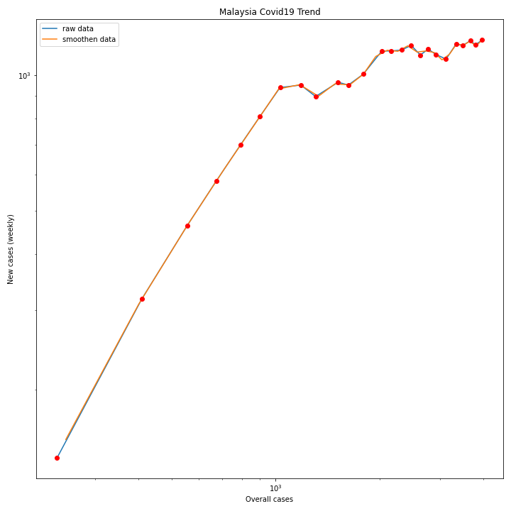
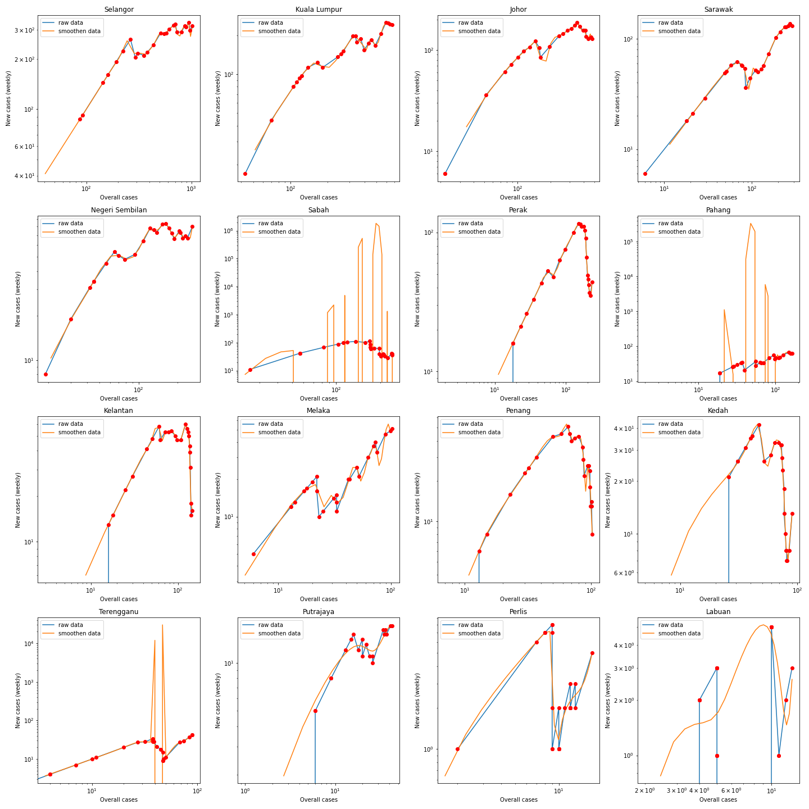

# Trajectory of Malaysia COVID-19 cases
Inspired by aatishb and minutephysics, this project aims to monitor the Covid19 trends in Malaysia. These chart would tell us if our country's policy in combating Covid19 is effective or not. Additionally, such insight could help us in finding lights of hope during this difficult time.

## Covid 19 treads of Malaysia

   
  Global Covid19 Trend in Malaysia (updated 8 April 2020)

   
  Global Covid19 Trend in different state of Malaysia (updated 8 April 2020)

## Original idea
>The graph plots the number of new confirmed cases in the past week, versus the total number of confirmed cases. When plotted in this way, exponential growth is displayed as a straight line.
*https://github.com/aatishb/covidtrends*

Screenshot from https://www.youtube.com/watch?v=54XLXg4fYsc indicating the trend of covid for log scale graph. This graph can be useful to identify if the pandemic is efficiently controlled by monitoring the downwards trend.

   
  Global Covid19 Trend by minutephysics

# Generate graphs and data
## Requirements
 - Python 3
   - numpy 
   - requests
   - BeautifulSoup
   - scipy 
   - matplotlib

Run generate_outbreak_json.py to create the json file as well as the graphs
>python generate_outbreak_json.py 

# Credits
Special thanks to https://www.outbreak.my/ for data source.  
Special thanks to https://aatishb.com/covidtrends/, and https://github.com/aatishb/covidtrends for the algorithm  
Special thanks to minutephysics's comprehensive interpretation of the curve shown in https://www.youtube.com/watch?v=54XLXg4fYsc
