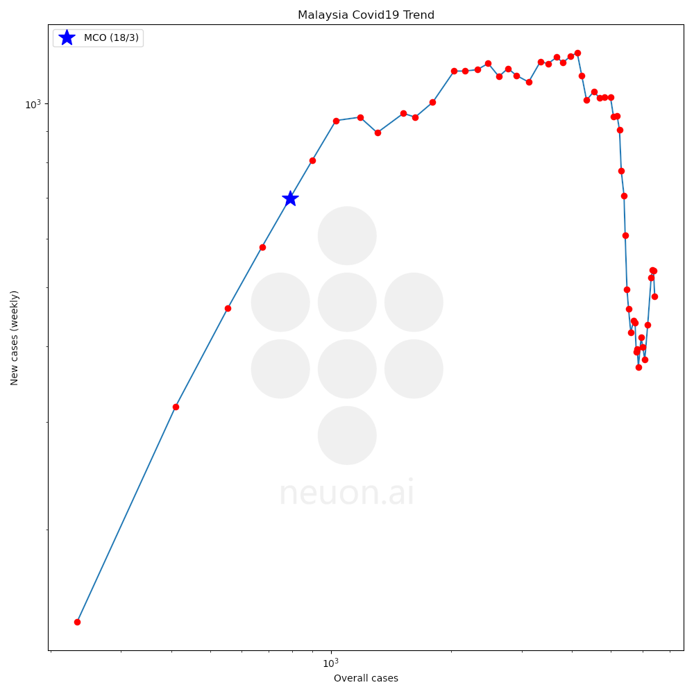
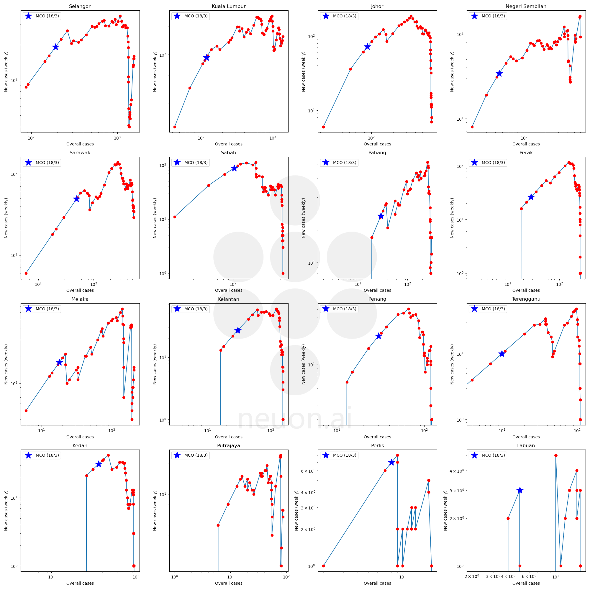
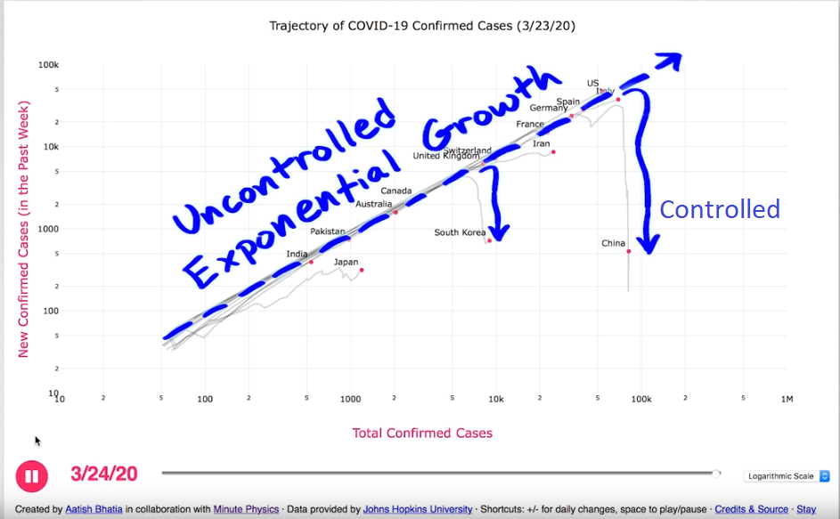

# Trajectory of Malaysia COVID-19 cases
Inspired by aatishb and minutephysics, this project aims to monitor the Covid19 trends in Malaysia. These chart would tell us if our country's policy in combating Covid19 is effective or not. Additionally, such insight could help us in finding lights of hope during this difficult time.

Different from traditional cases versus time/date graph, these graphs gives the weekly new cases versus overall cases in log scales. The  trend of the outbreak would be in straight line instead of exponential curves. By monitoring these charts, we would be able to tell if the situation of the outbreak had been combat effectively (details to state). Based on the trend, we could pin point which state are coping well with the pandemic and which are not to further analysis better and efficient way in resolving the pandemic.

## Covid 19 trends of Malaysia

   
  Global Covid19 Trend in Malaysia (updated 01 October 2020, 12:00 AM), 
  red markers indicate the date from 13 March to 11 September 2020

   
  Global Covid19 Trend in different state of Malaysia (updated 01 October 2020, 12:00 AM), 
  red markers indicate the date from 13 March to 11 September 2020

## Original idea
>The graph plots the number of new confirmed cases in the past week, versus the total number of confirmed cases. When plotted in this way, exponential growth is displayed as a straight line.
*https://github.com/aatishb/covidtrends*

Screenshot from https://www.youtube.com/watch?v=54XLXg4fYsc indicating the trend of covid for log scale graph. This graph can be useful to identify if the pandemic is efficiently controlled by monitoring the downwards trend.

   
  Global Covid19 Trend by minutephysics

# Generate graphs and data
## Requirements
 - Python 3
   - numpy 
   - requests
   - BeautifulSoup
   - scipy 
   - matplotlib
   - pillow

Run generate_outbreak_json.py to create the json file as well as the graphs
>python generate_outbreak_json.py 

# Credits
Special thanks to https://www.outbreak.my/ for data source.  
Special thanks to https://aatishb.com/covidtrends/, and https://github.com/aatishb/covidtrends for the algorithm  
Special thanks to minutephysics's comprehensive interpretation of the curve shown in https://www.youtube.com/watch?v=54XLXg4fYsc

# Supported by
Neuon AI Sdn Bhd.
www.neuon.ai
